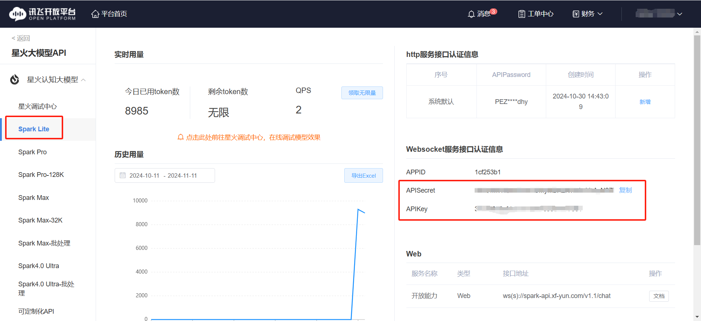

<h1 align="center">MindAI</h1>

本项目基于simple-mind-map二次开发

[simple-mind-map](https://github.com/wanglin2/mind-map)是一个简单&强大的 思维导图

# 新增功能

- AI一键生成思维导图

# 演示效果


# 开发

## clone

```bash
git clone https://github.com/loserintowinner/MindAI.git
cd MindAI
git checkout electron
```

## APIKey和APISecret

**星火大模型Lite版**提供无限Token，人人都可以领取。

进入[控制台页面](https://console.xfyun.cn/services/cbm)获取APIKey、APISecret



将项目web目录下的`env、env.develop、env.prod`文件中VUE_APP_SPARK_KEY、VUE_APP_SPARK_SECRET的值替换

```bash
VUE_APP_SPARK_URL=https://spark-api-open.xf-yun.com/v1/chat/completions
VUE_APP_SPARK_KEY=Your KEY
VUE_APP_SPARK_SECRET=Your SECRET
```

## 启动服务

在项目根目录下执行：

```bash
cd simple-mind-map
npm i
npm link
cd ..
cd web
npm i
npm link simple-mind-map
npm run electron:serve
```

## 打包客户端

打包`Windows`应用：

```bash
npm run electron:build-win
```

打包`Mac`应用：

```bash
npm run electron:build-mac
```

打包`Linux`应用：

```bash
npm run electron:build-linux
```

打包全部应用：

```bash
npm run electron:build-all
```

根据你的电脑系统自动打包：

```bash
npm run electron:build
```

想要实现更多功能？可以查看[开发文档](https://wanglin2.github.io/mind-map-docs/)。

# License

[MIT](./LICENSE)。保留`mind-map`版权声明的情况下可随意商用。如不想保留可联系作者。

